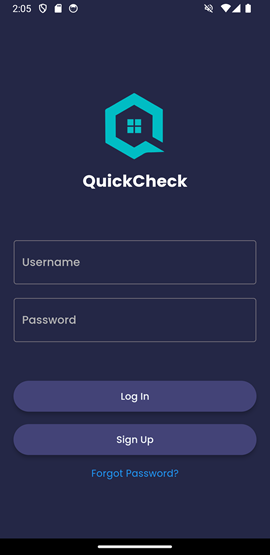
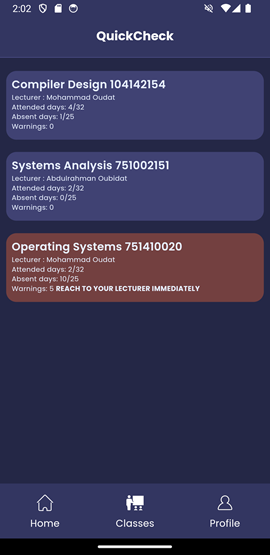
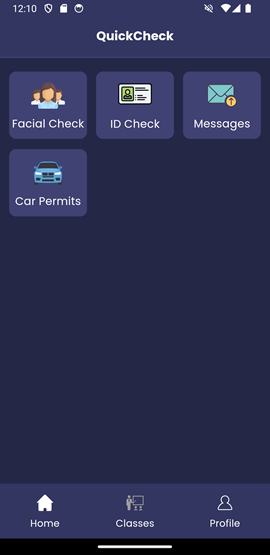

# QuickCheck

**QuickCheck** is my graduation project, a mobile application designed for efficient attendance tracking using facial recognition technology.

## Features
- **Comprehensive Attendance and Security Management**: QuickCheck integrates facial recognition technology to automate attendance tracking, minimizing manual intervention and enhancing accuracy for lecturers.
- **Vehicle Verification for Campus Security**: A dedicated feature for security personnel to capture and recognize vehicles entering the university, ensuring authorized access.
- **Real-Time Student Access**: Students can access real-time data, including attendance records, grades, and direct communication with lecturers through the app.
- **Technology Stack**: 
  - Frontend developed using Flutter.
  - Backend powered by Supabase, with a Flask API for handling facial recognition using the dlib library.
- **Additional Functionalities**: 
  - Automated attendance recording.
  - Facial recognition-based exam verification.
  - Secure student data management.
  - Notification system for suspicious activities and attendance issues.

## Screenshots

  

## License

This project is licensed under a custom license. The source code is available for viewing purposes only and cannot be used, modified, or redistributed without explicit permission. See the [LICENSE](LICENSE) file for more details.

## Note
> This project was developed very early in my experience with Flutter, over a span of 2.5 months. Given the tight timeline and frequent feature additions, code quality may not reflect industry standards, but it demonstrates the core functionality effectively.
